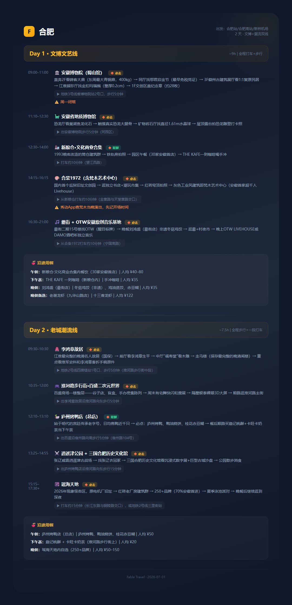

<div align="center">

<h1>🗺️ Fable Travel</h1>

<p>说一个城市名字，拿走一份能直接出发的旅行攻略。</p>

<p>
  
  
  
</p>

</div>

---


**你不是在做旅行研究，你是在被碎片信息反复消耗。**

想去一个城市：打开小红书刷 2 小时，收藏 30 篇笔记，然后忘了收藏在哪。打开点评看看餐厅评分，再去豆瓣找深度内容，去携程看酒店位置——信息散落在 6 个平台，没有一份能装进口袋的行程。

Fable Travel 就是来解决这个问题的。输入"西安 4 天"或者"洛阳周末两天"，3 个 AI Agent 同时开工——一个挖博物馆和考古发现，一个找本地人常去的街区和咖啡馆，一个筛真正好吃的店和有质量的深度内容——然后按地理位置合成路线，再自动生成一份 Markdown 文档和两张便携 PNG 卡片。

**整个过程你只说一句话，其余是 AI 的事。**

---


## 谁需要这个

- **独立旅行者**——自己做攻略，不想跟团也不想看流水线攻略
- **周末出发的上班族**——时间有限，想高效利用每一段空闲
- **city walk 爱好者**——不满足于大众景点，想走本地人走的路线
- **文化深度游的人**——要博物馆、要考古、要看镇馆之宝，但不想牺牲好吃的

如果你出发前会做功课，这就是你的工具。

---


## 它解决了什么

| 痛点 | Fable Travel 的做法 |
|------|-------------------|
| 信息散落在 6 个平台，看完就忘 | 一个入口，三路 AI 并发搜索，结果汇入一份文档 |
| 博物馆推荐和 city walk 路线互相不认识 | 文化侧 ~70% + 潮生活 ~30%，按地理聚合而非按主题分类 |
| 列了一堆想去的地方，不知道怎么串成路线 | 自动打地理标签 → 按区域聚合 → 不走回头路 |
| 攻略纯文字，到了还得翻 | 自动生成便携 PNG 路线卡，存手机就能用 |
| 单篇攻略只讲一类内容 | 三路 Agent 并行：文物考古 × 新潮生活 × 探店深度，互不依赖 |
| 不知道从哪里开始做功课 | 自然语言输入，不需要记任何参数格式 |

---


## 怎么用

### 一句话触发

直接在 Codex 对话中说：

| 你说 | 系统理解 |
|------|---------|
| "帮我做西安的旅行研究，4 天，聚焦唐代" | 城市=西安，天数=4，主题=唐代 |
| "洛阳出发前功课，2 天" | 城市=洛阳，天数=2，全域综合研究 |
| "大同 city walk 研究，2 天" | 城市=大同，天数=2，全域综合研究 |
| "苏州" | 城市=苏州 → 反问"玩几天？"后继续 |

自然语言就行，不需要记参数名。

### 你会拿到什么

```text
════ 旅行研究完成 ═══════════════════════
🏙️ 城市: 西安
📝 知识文档: travel-notes/西安旅行研究_2026-07-01.md
🖼️ 城市概览卡: downloads/西安_城市概览.png
🖼️ 路线速查卡: downloads/西安_路线速查.png
📍 路线: 3 条 | 🏛️ 博物馆: 5 个 | 🍜 探店: 7 家
📎 深度内容: 3 个视频 | 2 篇文章
```

### 输出内容长什么样

**Markdown 文档**包含：
- 路线概览（按天/区域组织，每个点标注交通衔接）
- 博物馆 + 考古发现（镇馆之宝、重点展厅、容易错过的）
- 新潮本地生活（咖啡馆、市集、livehouse、街区）
- 探店推荐（地址、人均、推荐菜、搭配路线）
- 深度内容推荐（B站视频、知乎/公众号文章）

**路线速查卡**（PNG）：
- 每天一条路线，每个点标注时间段和优先级（🔶必去 / ⚪可选）
- 交通指引具体到"沿XX路向XX方向步行 N 分钟，经过 XX 地标"
- 餐饮插入路线中，不单独成段

---


## 它是怎么工作的

### 三路并行研究

```text
用户说"西安 4 天"
        │
        ▼
   ┌─────────────────┐
   │  参数解析        │  提取城市 / 天数 / 可选主题
   └────────┬────────┘
            │
            ▼
   ┌────────────────────────────────────────────┐
   │  parallel()                                │
   │                                            │
   │  Agent 1 ─── 博物馆 + 考古 + 历史分层      │
   │  Agent 2 ─── 新潮本地生活 (咖啡/市集/街区) │
   │  Agent 3 ─── 探店 + 深度内容推荐           │
   │                                            │
   │  单个失败不影响其他，全部失败才终止         │
   └─────────────────────┬──────────────────────┘
                         │
                         ▼
   ┌────────────────────────────────────────────┐
   │  路线合成                                   │
   │  打地理标签 → 按区域聚合 → 时间排序        │
   │  → 穿插探店 → 古建融入路线说明             │
   └─────────────────────┬──────────────────────┘
                         │
                         ▼
   ┌────────────────────────────────────────────┐
   │  输出                                       │
   │  Markdown 文档 + 城市概览卡 + 路线速查卡    │
   └────────────────────────────────────────────┘
```

### 关键设计决策

- **路线是核心产出**——地理位置聚合、交通效率优先，而非按主题分类。每一条路线都是从 A 到 B 不走回头路的可执行行程。
- **文化 ~70% + 潮流 ~30%**——博物馆和考古的分量更重，但 city walk 和探店让每天有呼吸感。
- **操作式看点**——每个地点告诉你是「到了做什么」，而不是「这是什么」。不写百科式介绍。
- **不编造**——没有确切信息的地方留空。宁可不写，不写假内容。
- **单 Agent 容错**——3 个 Agent 中任何一个失败，不影响另外两个的结果和最终输出。

### 输出示例

<div align="center">
  
  <p><em>fable-travel 自动生成的路线速查卡 · 合肥 4 天</em></p>
</div>

---


## 🚀 安装

### 系统要求

- **Node.js >= 18**
- **Codex**（桌面版或 CLI 均可）
- **Tavily API Key**（用于旅行研究的搜索，[免费申请](https://tavily.com)）

### 第 1 步：安装 npm 依赖

```bash
cd fable-card
npm install
npx playwright install chromium
```

> `fable-card` 负责将研究结果铸造成 PNG 卡片。不安装则技能仍可工作，但不会产出便携卡片。

### 第 2 步：注册技能到 Codex

Codex 从 `~/.codex/skills/` 目录自动加载技能。把 `fable-travel/` 和 `fable-card/` 放到那里即可。

**方案 A：软链接（推荐，改代码即时生效）**

```powershell
# 在项目根目录执行
New-Item -ItemType Junction -Path "$env:USERPROFILE\.codex\skills\fable-travel" -Target ".\fable-travel"
New-Item -ItemType Junction -Path "$env:USERPROFILE\.codex\skills\fable-card" -Target ".\fable-card"
```

```bash
# macOS / Linux
ln -s "$PWD/fable-travel" ~/.codex/skills/fable-travel
ln -s "$PWD/fable-card" ~/.codex/skills/fable-card
```

**方案 B：直接复制**

```powershell
Copy-Item -Recurse .\fable-travel $env:USERPROFILE\.codex\skills\fable-travel
Copy-Item -Recurse .\fable-card $env:USERPROFILE\.codex\skills\fable-card
```

### 第 3 步：配置 Tavily MCP

编辑 `.mcp.json`，将 `tavilyApiKey` 的值替换为你自己的 key。

或全局配置到 `~/.codex/config.toml`：

```toml
[mcp_servers.tavily]
url = "https://mcp.tavily.com/mcp/?tavilyApiKey=你的API_KEY"
```

---


## 项目结构

```text
fable-travel/                 # 旅行研究技能（核心）
├── skill.md                  # 技能定义（含触发词、执行策略、输出 schema）
└── problem.md                # 内部审查记录

fable-card/                   # 图片铸造技能（辅助产出）
├── SKILL.md                  # 技能定义
├── generate-card.js          # 卡片生成入口
├── assets/
│   ├── capture.js            # Playwright 截图工具
│   ├── long_template.html    # 长图模板
│   └── infograph_template.html  # 信息图模板
└── references/
    ├── taste.md              # 视觉品味准则
    ├── mode-long.md          # 长图模具规范
    └── mode-infograph.md     # 信息图模具规范

.mcp.json                     # Tavily MCP 配置
README.md                     # 本文件
```

---


## 设计理念

**不是旅行攻略，是旅行工具。**

大多数旅行内容平台解决的是"怎么去"——交通、住宿、门票。Fable Travel 解决的是"怎么玩"——一个城市的文化骨架在哪里，年轻人真正在去的街角在哪里，好吃的在不经意的巷子里。

三路 Agent 不是功能炫技，是结构性的必需品：一个城市的文化深度、日常呼吸、生活味道——这三个面向无法由单一路径覆盖。只有让它们各自独立搜索、最后合在一起，才接近一个真实的城市切片。

---


## License

MIT — 随意使用，欢迎贡献。

---


<div align="center">
  <sub>说一个城市名字，拿走一份能直接出发的旅行攻略。</sub>
</div>
